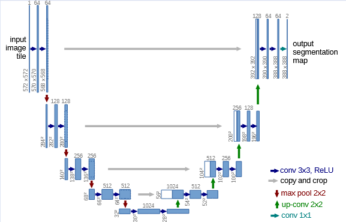

# Rock Image Segmentation
[](LICENSE)
🔥 **项目亮点**  
• 训练时自动根据不同数据集类型进行数据增强  
• 构建了系列基于UNet框架网络的变体模型及其他架构分割网络
• 训练时使用`tensorboard`及`Swanlab`实时记录训练日志

### UNet
<div align="center">



</div>

#### 快速开始
```bash
git clone https://github.com/Runner-xc/Unet.git
```
##### 安装依赖
```bash
conda create -n rocks python=3.10
conda activate rocks
pip install -r requirements.txt
```
##### 数据集
```text
# 数据集目录结构
├── datasets
│   ├── CSV
│   ├── aug_results
│   ├── images           # 原图片
│   │    ├── 512         # 图片尺寸
│   │    └── 256
│   └── masks            # 掩码标签
│        ├── 512 
│        └── 256
# 本项目针对页岩数据集中OM、OP、IOP三个类别，请根据自己的分割类别调整utils/loss_fn.py、utils/metrics.py、utils/writing_logs.py、predict.py、train.py
```

```bash
# 划分数据集,设置好数据地址
cd Unet/utils
python rock_data.py
```